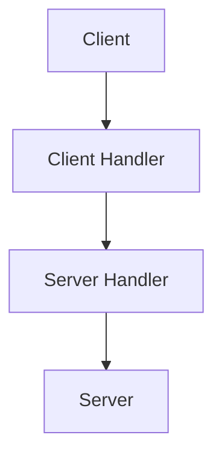

# Building RMI application
1. Define the interfaces.
2. Implement the server.
3. Implement the client.


# Running an RMI application
1. Run rmiregistry.
2. Run the Server.
3. Run the Client.

There is no need to worry about explicit multithreading.


## RMI Communication
```plantuml


```

